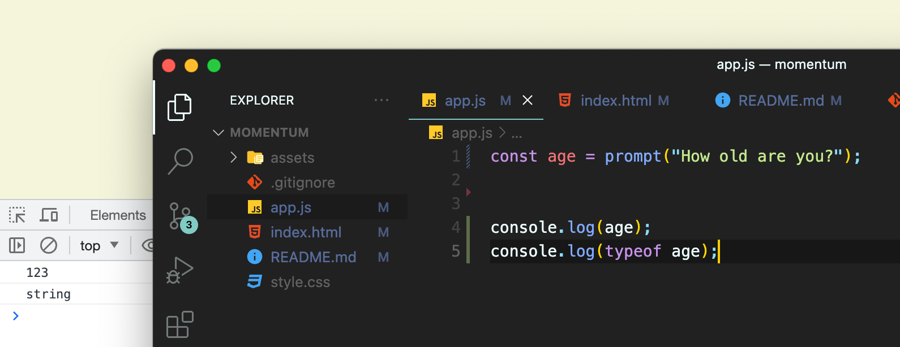

# JavaScript 복습: 모멘텀 클론코딩

> 2022년 4월부터 8월까지 4월간 국비지원 교육을 받았으나 개인 사정에 의해 수학학원에서 일을 하게 되면서 1년간의 공백이 생겼다. 다시 개발 공부를 시작하면서 가장 간단하면서도 꼭 알아야 하는 javascript부터 시작하기로 결정했다. 과정은 [노마드코더](https://nomadcoders.co) 사이트에서 무료로 제공하는 모멘텀 클론코딩으로 정했다.

 

## 학습 목표

- 최대한 빠른 시간 안에 코딩에 대한 감각 익히기
- 기본적인 git, github 사용법 숙지하기
- javascript 복습

 

## 목차

- [JavaScript 복습: 모멘텀 클론코딩](#javascript-복습-모멘텀-클론코딩)
  - [학습 목표](#학습-목표)
  - [목차](#목차)
- [0. git, github 사용하기](#0-git-github-사용하기) - [-`git init`](#-git-init) - [-`git status`](#-git-status) - [-`git remote`](#-git-remote) - [-`git add`](#-git-add) - [-`git commit -m '커밋메세지'`](#-git-commit--m-커밋메세지) - [-`git push origin master`](#-git-push-origin-master)
  - [-`git merge <브랜치 이름>`](#-git-merge-브랜치-이름)
  - [-`git pull origin master`](#-git-pull-origin-master)
- [1. requirements](#1-requirements)
- [2 javacript basic](#2-javacript-basic)
  - [- 2.0 Your First JS Project](#--20-your-first-js-project)
  - [- 2.1 Basic Data Types](#--21-basic-data-types)
  - [- 2.2 Variables](#--22-variables)
  - [- 2.3 const and let](#--23-const-and-let)
  - [- 2.4 Booleans](#--24-booleans)
  - [- 2.5 Arrays](#--25-arrays)
  - [- 2.6 Objects](#--26-objects)
  - [- 2.7 Function part One](#--27-function-part-one)
  - [- 2.8 Function part Two](#--28-function-part-two)
  - [- 2.10 Returns](#--210-returns)
  - [- 2.12 Conditionals](#--212-conditionals)
  - [- 2.13 Conditionals part Two](#--213-conditionals-part-two)
  - [- 2.14 Conditionals part Three](#--214-conditionals-part-three)
- [3. javascript on the browser](#3-javascript-on-the-browser)
  - [- 3.0 The Document Object](#--30-the-document-object)
  - [- 3.1 HTML in javascript](#--31-html-in-javascript)
  - [- 3.2 Searching For Elements](#--32-searching-for-elements)
  - [- 3.3 Events](#--33-events)
  - [- 3.4 Events part Two](#--34-events-part-two)
  - [- 3.5 More Events](#--35-more-events)
  - [- 3.6 CSS in Javascript](#--36-css-in-javascript)
  - [- 3.7 CSS in JavaScript part Two](#--37-css-in-javascript-part-two)
  - [- 3.8 CSS in Javascript part Three](#--38-css-in-javascript-part-three)
- [4. Login 만들기](#4-login-만들기)
  - [- 4.0 Input Values](#--40-input-values)
  - [- 4.1 Form Submission](#--41-form-submission)
  - [- 4.2 Events](#--42-events)
  - [- 4.3 Events part Two](#--43-events-part-two)
  - [- 4.4 Getting Username](#--44-getting-username)
  - [- 4.5 Saving Username](#--45-saving-username)
  - [- 4.6 Loding Username](#--46-loding-username)
  - [- 4.7 Super Recap](#--47-super-recap)
- [5. CLOCK 만들기](#5-clock-만들기)
  - [- 5.0 Intervals](#--50-intervals)
  - [- 5.1 Timeouts and Dates](#--51-timeouts-and-dates)
  - [- 5.2 PadStart](#--52-padstart)
- [6. QUOTE AND BACKGROUND](#6-quote-and-background)
  - [- 6.0 Quotes](#--60-quotes)
  - [- 6.1 Background](#--61-background)
- [7. TO DO LIST](#7-to-do-list)
  - [- 7.0 Setup](#--70-setup)
  - [- 7.1 Adding ToDos ~ 7.2 Deleting To Dos](#--71-adding-todos--72-deleting-to-dos)
  - [- 7.3 Saving To Dos](#--73-saving-to-dos)
  - [- 7.4 Loading To Dos part One](#--74-loading-to-dos-part-one)
  - [- 7.5 Loading To Dos part Two](#--75-loading-to-dos-part-two)
  - [- 7.6 Deleteing To Dos part One](#--76-deleteing-to-dos-part-one)
  - [- 7.7 Deleting To Dos part Two](#--77-deleting-to-dos-part-two)
  - [- 7.8 Deleting To Dos part Three](#--78-deleting-to-dos-part-three)

 

# 0. git, github 사용하기

[\*git 사용법 정리](https://backlog.com/git-tutorial/kr/intro/intro1_1.html)

#### -`git init`

: 터미널에서 git으로 관리할 디렉토리로 들어간 후 `git init` 을 입력하면 git으로 관리하는 디렉토리가 된다. (.git 디렉토리가 생긴 것을 확인할 수 있다.)

#### -`git status`

: 디렉토리 내에 있는 파일들의 수정 상태와 commit 여부를 확인할 수 있다.

#### -`git remote`

- `git remote -v`
  : 디렉토리와 원격저장소의 연결 상태를 확인할 수 있다. `git init` 만 했다면 아무것도 뜨지 않는다.

  

- `git remote add <이름> <원격저장소 주소>`

  : 현재 디렉토리를 github의 원격저장소와 연결한다. 연결 후 다시 `git remote -v`로 연결 상태를 확인할 수 있다.

  

#### -`git add`

- `git add .`: 모든 파일을 Staging Area로 등록한다.
- `git add <파일명>`: 지정한 파일만 Staging Area로 등록한다.

#### -`git commit -m '커밋메세지'`

: 앞서 Staging Area에 있던 파일들을 commit한다. 커밋메세지는 해당 commit의 이름으로 등록된다.

(`git commit`만 하면 vim 편집기로 커밋 내용을 저장해야 했던 것 같은데 vim 편집기 사용은 아직 어려우니 가급적 `git commit -m`사용. 참고로 vim 편집기에서 빠져나오려면 `:` 키를 먼저 누르고 `q` 를 누른 후 엔터를 눌러 빠져나오면 된다.)

#### -`git push origin master`

: commit한 내역을 원격저장소로 보내서 동기화한다.

> - push 도중 에러 발생 
>
> 
>
> master 브랜치가 없어서 문제가 생겼다면, git init 할 때마다 master 브랜치를 만들어 줘야 하는 것인가? 하는 의문이 들어서 검색해봤다.
>
> [git에서 origin에 관한 참고자료](http://daplus.net/git-git-push-origin-master%EC%97%90%EC%84%9C-origin%EC%9D%98-%EC%9D%98%EB%AF%B8%EB%8A%94-%EB%AC%B4%EC%97%87%EC%9E%85%EB%8B%88%EA%B9%8C/)
>
> [git에서 기본 브랜치를 바꾸는 방법](https://blog.outsider.ne.kr/1503)
>
> [git에서 원격저장소와 로컬저장소의 브랜치 통일](https://m.blog.naver.com/corrosion521/223041408390)
>
> [git에서 원격, 로컬저장소의 기본 브랜치 바꾸는 방법 (총정리)](https://m.blog.naver.com/corrosion521/223041408390) 
>
> 결론은 `git push origin <브랜치 이름>`에서 브랜치는 로컬 저장소의 브랜치 이름과 원격 저장소의 브랜치 이름이 일치해야 한다. 즉, 로컬 저장소에 존재하지 않는 브랜치 이름으로 push할 순 없다. 반면에, 로컬 저장소에만 존재하고 원격 저장소에는 없는 브랜치를 push하면 원격저장소에 같은 이름의 브랜치가 새로 만들어진다. 
>
> master, slave 관계가 인종차별적 의미를 가지고 있기 때문에 현재는 main을 기본 브랜치로 사용한다고 한다. 아마 지금 충돌이 났던 이유는 지난 국비지원 교육 과정에서 강사님이 하라는 대로 github와 git의 default 브랜치 이름을 master로 모두 바꾸었다가, 장기간 사용하지 않으면서 git의 default만 main으로 초기화 되어 생긴 이슈라고 생각한다. 

### -`git merge <브랜치 이름>`

- ff(fast-forward) : 현재 선택된 브랜치는 수정사항이 없고, 지정한 브랜치만 커밋이 존재할 때, 그 상태로 바꿔주는 것을 의미.

- non fast-forward : 두 브랜치 모두 수정사항이 존재하여 각각의 수정사항을 합치는 것을 의미. 

### -`git pull origin master`

: github의 원격 저장소의 커밋 내용을 로컬 저장소로 가져와서 합친다. (fetch + merge)

> - push 도중 에러 발생
>
> 
>
> 원격 저장소는 그대로 있는 상태에서 로컬 저장소에 커밋한 내용이 있어서 오류가 발생했다. 내용을 합쳐서 다시 push하기 위해서 `git config pull.rebase false`실행하여 충돌한 파일에서 충돌한 지점을 수정하면 다시 commit 할 수 있는 것 같다.

 

# 1. requirements

javascrip는 프론트엔드 개발을 하려면 필수적이다. 프레임 워크를 이용하면 백엔드 개발도 가능하다. VScode를 이용하여 javascript를 다뤄 볼 예정이다.

 

# 2 javacript basic

### - 2.0 Your First JS Project

: javascript가 작동하는 방식에 대한 설명이다. javascrip는 별도의 프로그램 설치 없이 모든 브라우저에서 작동한다. console에서 명령을 내리면 바로 출력이 나오기도 하지만, 복잡한 프로그램을 만들기 위해서는 파일명.js 형태로 자바스크립트 파일을 만들고, html 파일에서 불러오는 형식으로 작동한다. (css도 마찬가지)

VScode에서 html 파일을 연 다음 `!`로 자동으로 기본 뼈대를 만들 수 있다.

css 파일은 head안에, 그리고 title 위에서 가져온다. (rel은 relationship의 약자)

그리고 js 파일은 body 안에서 가져온다.

앞으로의 수업에서는 js 파일을 편집해가면서 html 파일을 열었을 때 어떻게 작동하는지 확인할 예정이다.

 

### - 2.1 Basic Data Types

자바스크립트에서는 자동으로 Date Type을 인식한다.

 

### - 2.2 Variables

- `console.log( )` : ( ) 안의 내용을 콘솔에 출력. 참고로 문자는 따옴표로 묶어줘야 하는데, 큰 따옴표, 작은 따옴표 아무거나 써도 상관 없다.

variable : 값을 저장하거나 유지하는 역할

- const : 바뀌지 않는 값, 바뀌면 안되는 값을 선언할 때 사용한다.

자바스크립트에서 변수명을 작성할 때는 단어와 단어 사이를 구분하기 위해 첫 문자를 대문자로 쓰는 것이 관례(camelCase), 파이썬에서는 \_를 이용해서 구분한다.(snake_case)

 

### - 2.3 const and let

variable(변수)를 만들 때는 const와 let을 이용해서 선언할 수 있다.

- let : 변하는 값을 선언할 때 사용한다. (const로 선언한 변수는 업데이트 하면 오류가 발생한다.)

그렇다고 let만 쓰면 안된다. const는 변하면 안되는 수에만 쓴다. 이런 특징을 이용하면 변수들만 보고도 작성자의 의도를 유추 할 수 있다. (예를 들면, 'let으로 선언한 걸 보니 어디선가 업데이트 되겠구나') 따라서 기본적으로는 const를 쓰고, 업데이트가 필요한 경우에만 let을 써라.

- var : 과거에 쓰던 형태. 어디서든 업데이트 할 수 있음. 실수로 업데이트 하더라도 문제가 발생하지 않는다.

다시 말하지만, var은 과거에 쓰던 거고 var을 사용한다면 해당 변수가 어떤 의도로 쓰였는지 전혀 알 수 없기 때문에 절대 쓰지 마라. const가 기본이고, 업데이트가 필요한 변수라면 let을 사용한다.

 

### - 2.4 Booleans

- true : 참 (켜져있음)
- false : 거짓 (꺼져있음)
- null : 아무것도 없다. 값이 비어있다. null은 자연적으로 발생하는 것이 아니라, 없다는 것을 확실히 하기 위해서 우리가 null이라는 비어있는 값을 주어준 것. 자바스크립트에게 여기엔 비어있다는 것을 알려주려고 사용. (파이썬에서는 None으로 사용.)
- undifined : 만들었지만 아무런 값을 주지 않았다. 컴퓨터 메모리 안에는 공간은 차지하지만, 값이 들어가지 않았다.

이 네가지의 공통점은 text가 아니라 type이라는 것.

 

### - 2.5 Arrays

가장 기본적인 데이터 구조.

\*vscode에서 단어를 한번에 수정하려면 단어 선택 후 `cmd + shift + L `

[ ]안에 집어넣으면 되고 각각의 자료형은 다 달라도 상관없다. 쉼표(,)로 구분만 잘 하면 된다.

> 
>
> 첫번째 줄이 쓰는 법이고 밑이 읽는 법이다. 배열은 0부터 채워넣기 때문에 5를 출력하면 6번째인 "sat"가 출력된다.
>
> 
>
> 항목을 추가하고 싶다면, array의 함수 .push( )를 이용해서 맨 뒤에다가 항목을 추가할 수 있다.

 

### - 2.6 Objects

배열처럼 여러 항목을 넣을 수 있는데, 각 항목의 순서만 나열된 것이 아니라 이름이 정해진 것.

object는 const로 선언했지만 자유롭게 항목의 값을 업데이트하거나 추가할 수 있다. 여기서 player라는 object 자체는 const이지만 각 항목은 const가 아니라고 생각하면 될 것 같다. 사실은 `console.log( )`에서 사용하는 log도 console이라는 object 안에 있는 하나의 항목이다.

 

### - 2.7 Function part One

앞서 player라는 object에서 name항목을 가져올 때 `player.name`을 이용했는데 `console.log( )`와 다른 점은 괄호의 유무이다. 괄호가 있으면 함수이다.

함수란, 자주 사용하는 것을 반복해서 사용하기 편하도록 해놓은 것이다.

 

### - 2.8 Function part Two

괄호 안에 있는 값을 받아서 function 안에서 처리할 수 있다. 함수를 선언할 때 괄호 안에 어떤 값을 받을지 순서대로 지정해준 다음, 함수 안에서 그 변수들을 받아서 처리하면 된다. 단, 여기서 사용하는 변수들은 함수 안에서만 존재한다. 함수가 끝나는 순간 사라져버림.

> - object 안에서 함수를 선언하는 방법
>
> 
>
> 위와 같이 함수를 선언하면 `console.log()`에서 사용했던 형태의 함수를 만들 수 있다.

 

### - 2.10 Returns

이때까지 쓴 함수는 함수 안에 적어놓은 기능만을 수행했다. (예를 들면, console.log( ) )

함수에서 어떤 결과값을 얻으려고 한다. 함수 안에서 `return <반환할 값>`을 적으면 해당 함수를 호출 했을 때 그 결과값이 반환된다.

> 
>
> 참고로 상수는 브라우저에서 이름만 쳐보면 값 확인 가능

 

### - 2.12 Conditionals

- `prompt("메세지")`: 메세지를 띄워 보여주고, 사용자가 값을 입력하면 그 값을 받아옴. 아주 오래된 방법이고 css를 적용할 수 없을 뿐더러 답하기 전까지 이 라인에서 동작을 멈추기 때문에 사용 안한다.

- type을 바꾸는 방법 : `parseInt( )`

123을 입력하고 받아온 값의 type을 확인해보니 string이다.

`parseInt( )`이용해서 string 을 int로 바꿀 수 있다.

입력한 값이 숫자가 아니면 NaN(Not a Number)이 나온다.

그래서 이런 형태로 쓰면 한번에 처리 가능하다.

 

### - 2.13 Conditionals part Two

- `inNaN( )` : 괄호 안의 값이 NaN인지 판별하여 boolean으로 반환해준다.

123을 입력하면 위와 같이 나오고,

asd를 입력하면 아래와 같이 나온다.

이제 condition을 확인한다. `if ( ) {  }`에서 ( ) 안에 있는 값이 true이면 { }안에 있는 코드를 실행.

숫자가 아닌 값을 입력하면 condition이 true니까 이렇게 나옴.

숫자를 입력하면 condition이 false라서 else안에 있는 코드를 실행.

 

### - 2.14 Conditionals part Three

- AND( `&&`) : 둘 다 true 여야 true.
- OR(`||`) : 둘 중 하나라도 true이면 true.

나이를 입력하면 음주 가능 여부를 나타내도록 작성하였다.

 

# 3. javascript on the browser

### - 3.0 The Document Object

HTML의 property들은 Object에서 불러오듯이 쓸 수 있다.

 

### - 3.1 HTML in javascript

javascript에서 HTML의 property들을 불러오거나 바꿀 수 있다.

 

### - 3.2 Searching For Elements

- `document.getElementById( 아이디 )` : 아이디가 괄호 안에 있는 텍스트와 일치하는 것을 가져옴

- `document.getElementByClassName( 클래스 )` : 클래스가 괄호안에 있는 텍스트와 일치하는 것을 배열 형태로 가져옴

- `document.querySelector(  )` : 괄호 안에다가 css selector 방식으로 원하는 것을 가져올 수 있다. 하나의 element를 가져올 수 있음. 만족하는 것 중 첫번째 element만 가져올 수 있다.

  

- `document.querySelectorAll(  )` : element 전부를 가져올 수 있다.

 

### - 3.3 Events

javascript는 페이지에서 일어나는 event들을 listen 하고 있다. 이걸 이용해서 event가 발생하면 내가 원하는 동작을 수행하도록 할 수 있다.

- `[element].addEventListener([이벤트 종류], [실행할 동작])` : element에 해당 이벤트가 발생하면 동작을 실행한다.

  

  Grab me1을 클릭하면 파란색으로 바뀐다. 8번 라인에 `handleTitleClick()`가 아니라 함수 이름만 넘겨주는 것에 명심하자. 어떤 함수를 실행할 지 정해준 것이다. `()`은 실행의 의미를 가지기 때문에 javascript는 그 자리에서 함수를 실행해버림

 

### - 3.4 Events part Two

event를 찾는 방법은 ''[element] html element mdn' 이라고 검색하고 제목 뒤에 'Web APIs(JavaScript관점의 HTML Heading Element를 의미함)'라는 문장이 포함된 페이지를 찾는다.

아니면 `console.dir( [element] )`를 이용해서 element 안에 있는 property들을 살펴보면 event도 찾을 수 있다.

여기서 on-으로 시작하는 property들은 다 event를 의미하는데, event로 불러올 때는 on을 빼고 써야 한다.

> 
>
> 테스트 삼아 만들어봄. title이라는 element 위에 커서가 올라가거나 떠나면 innerText를 바꿔주고, 클릭하면 색상을 바꿔준다.

우리가 하는 건, JavaScript로 HTML element를 가져오고, 가져온 element에 listener를 추가해주고, event가 발생하면 function을 실행시켜준다.

 

### - 3.5 More Events

- `[Element].[Event] = [function]` : Listener를 사용하지 않고도 Event에 따른 함수를 동작하도록 할 수 있다.

  

  Listener를 쓰면 나중에 remove로 지울 수 있는 장점이 있는데 작동은 둘 다 가능하니 선호하는 형태로 쓰면 된다.

그 외 다양한 Event들은 element MDN에서 검색할 수 있으니 찾아서 써보도록 하자.

 

### - 3.6 CSS in Javascript

그냥 간단한 if else 사용해서 CSS 바꿔봄.

 

### - 3.7 CSS in JavaScript part Two

javascript는 애니메이션에는 적합하지만 CSS를 설정하는일은 CSS에서 하는 것이 적합할 것. 하지만, 이번 시간에는 javascript와 HTML, CSS간의 연결에 대해 공부한다.

CSS파일에 미리 .clicked에 해당하는 property를 설정해놓고, javascript에서는 CSS를 바꾸는게 아니라 className을 바꾼다.

> - 변수 선언하여 오류 줄이기
>
>   
>
>   이 상태에서는 만약에 clicked를 적다가 오타가 나면 어디서 오류가 났는지 console에 나타나지 않음.
>
>   
>
>   이렇게 고치면 만약에 clickedClass를 적는 과정에서 오타가 나더라도 console에서 알려줌.
>
>   따라서, String을 const로 선언하는 형태는 오류를 줄이기 위해서 자주 쓰임.

 

### - 3.8 CSS in Javascript part Three

- `[element].classList`: class들의 목록으로 작업할 수 있게끔 허용
- `[element].classList.contain([클래스 이름])`: 클래스 이름을 가지고 HTML element 안에 해당 클래스가 존재하는지 찾고 boolean을 반환한다.
- `[element].classList.add([클래스 이름])`: element의 classList에 해당 클래스를 하나 추가함
- `[element].classList.remove([클래스 이름])`: element의 classList에서 해당 클래스를 제거함

- `[element].classList.toggle([클래스 이름])`위의 코드와 같은 기능을 toggle함수 하나만으로 구현할 수 있다.

clicked가 존재하면 삭제하고, 존재하지 않으면 추가하겠다는 뜻.

 

# 4. Login 만들기

### - 4.0 Input Values

- `<input type="[type]"> </input>` : HTML에서 `input:[type]`입력 후 엔터를 치면 input element가 만들어진다.
- `<button> [버튼 안에 넣을 텍스트] </button>` : 버튼을 생성할 수 있다.

 

### - 4.1 Form Submission

> #### \* input type에 따른 사용
>
> - text : text를 입력할 수 있게 함. String으로 받는다.
>   - required를 넣으면 빈칸허용 불가.
>   - maxlenghth를 넣으면 글자수 제한 가능.
>   - placeholder를 넣으면 아무 글자도 없을 때 상자 안에 띄워질 텍스트 설정 가능.
>
>  
>
> - submit : input으로 생성한 button인데, form 안에서 사용하는 button이다. value는 button 안에 들어갈 텍스트.

form 안에 있는 button나, input type="submit"을 클릭하면 자동으로 form이 submit 된다. 버튼이 여러개 있어도 다 같은 기능을 함.

 

### - 4.2 Events

그리고 버튼을 클릭하면 url 맨 뒤가 물음표로 바뀌면서 화면이 넘어가는 것을 확인 할 수 있다.

하지만 우리는새로고침 되는 걸 막아야 한다. 브라우저는 엔터를 누를 때 submit 하면서 새로고침하는게 기본 동작인데 그걸 막아야 한다.

그 전에 중요한 거 하나가 있는데, Listener에서 onLoginSubmitrk 를 실행할 때는 자동으로 어떤 argument를 가지고 온다. 확인해보자.

tomato를 argument로 받아서 argument가 존재하는지 확인해보기 위해서 `console.log(tomato)` 했더니 콘솔에 찍혀있다. 이 argument를 이용해서 앞으로 많은 것들을 하게 될 것. 다시 정리하면, EventListener로 실행되는 함수는 어떤 정보(information)들을 argument로 가져온다.

그래서 여기 있는게 해당 이벤트에 대한 정보들이다. 예를들면, submitter: input 에서 주체가 input인 것을 알 수 있다.

- `[information].preventDefault()` : event의 기본행동(submit에 새로고침 같은 거)이 발생하지 않도록 막는 역할.

 

> information에 해당하는 argument를 받아 올 때는 argument 이름을 event로 설정하는 것이 관례.
> 

이제 새로고침 되는 걸 막았으니 `console.log(loginInput.value)`를 찍어보면 새로고침 없이 value를 막을 수 있다.

 

### - 4.3 Events part Two

anchor(<a>)를 클릭했을 때는 어떤 event가 발생하는지 살펴봄. (강의에서는 MouseEvent가 발생했고 내 컴퓨터에서는 PointerEvent가 발생함.)

<vr>

### - 4.4 Getting Username

- string과 변수를 합치는 방법
  
  밑에 있는 방법을 많이 사용하면 편하다. `${변수 이름}`으로 사용하면 되고, 작은 따옴표가 아니라 백틱(``)을 이용해야 함.

 

### - 4.5 Saving Username

이제 유저이름 받아오는 건 완성했고, username을 저장하도록 하려고 한다.
기록할 수 있도록 해주는 API가 localStorage이다.

- `localStorage.setItem([key],[value])` : localStorage에서 정보를 저장할 수 있게 해준다.
- `localStorage.getItem([key])` : localStorage에 저장된 정보를 불러올 수 있다.
- `localStorage.removeItem([key])` : localStorage에 저장된 정보를 삭제한다.

 

### - 4.6 Loding Username

lacalStorge에 username이 존재하면 form 대신 h1을 보여준다.

 

### - 4.7 Super Recap

paintGreetings에서 argument를 꼭 받아올 필요가 없다. 이미 localStorage에 username을 저장했으니 거기서 불러오도록 코드 작성.

form이 나올때만 Listener를 달아주면 되니까 addListener도 if문 안에 넣어줌.

 

# 5. CLOCK 만들기

### - 5.0 Intervals

- divide and conquer : 기능마다 새로운 .js 파일을 만들어서 사용하는 방식

- `setInterval([실행시킬 함수], [주기 ms])` : 일정 시간마다 새로운 일이 일어나도록 설정할 수 있다.
  

 

### - 5.1 Timeouts and Dates

- `setTimeout([실행시킬 함수], [주기 ms])` : 일정 시간이 지나면 일이 발생하도록 함.

> Date object
>
> 컴퓨터에서 현재 날짜,시간 등 정보를 가져올 수 있다.
>  > 

코드 작성

 

### - 5.2 PadStart

- `[String].padStart([최소로 필요한 문자 수], [부족할 경우 채워 넣을 문자])`
  

- `[String].padEnd([최소로 필요한 문자 수], [부족할 경우 채워 넣을 문자])`
  

코드 작성

date.getHours() 에서 나오는 값은 number이므로 String 으로 바꿔야 한다.

- `String([string이 아닌 문자])` : String으로 만들어줌.

 

# 6. QUOTE AND BACKGROUND

### - 6.0 Quotes

- `Math`
  

코드 작성

 

### - 6.1 Background

- `createElement([생성할 element])` : HTML Element를 생성하는데, document 안에 만드는게 아니라서 따로 넣어줘야 함.
- `document.body.appendChild([element])` : body에 element 추가. (가장 밑에)
- `document.body.appendChild([element])` : body에 element 추가. (가장 위에)

코드 작성

 

# 7. TO DO LIST

### - 7.0 Setup

코드 작성

 

### - 7.1 Adding ToDos ~ 7.2 Deleting To Dos

코드 작성

event 안에 target이라는 property가 있다. 여기서 이벤트 발생 위치에 대한 정보를 알 수 있다.

여기서 target은 클릭한 버튼이고, 버튼의 parentElement가 li가 된다.

8번 라인에 오타 있음. `.innerText`는 지워야 함.

 

### - 7.3 Saving To Dos

코드 작성

이렇게 작성하면

배열 형태로 저장할 수 없음.

> local Storage 저장 결과를 배열 형태로
>
> - `JSON.stringify([변수])` : 변수가 무엇이든 String으로 바꿔준다.
>
> 
>
> 

 

### - 7.4 Loading To Dos part One

전체적인 컨셉은 local storage에 String으로 저장해서 불러올 땐 그 String을 javascript언어로 바꿔주는 것.

- `JSON.parse([string])` : string을 javascript언어로 바꿔줌
  
  

- `[배열].forEach([함수])`
  
  배열 안에 있는 각각의 item에 대해서 한번씩 어떤 함수를 작동시킬 때 사용. item은 event를 자동으로 제공했던 것 처럼 사용할 수 있음.
  또는 아래 방법처럼 arrow function 이용해도 됨.
  

어차피 배열 안에 있는 값들을 하나씩 넣을 것이기 때문에, paintToDo에 그대로 사용해도 된다.

47번 라인과 48~50 라인은 의미가 같다.

 

### - 7.5 Loading To Dos part Two

- Local Storage에 있는 String을 배열 toDos에 집어넣는 방법
  - forEach로 각각 넣어주기
    
    
    함수를 새로 정의해서 넣어줄 수 있다.
  - 배열 toDos를 let으로 선언한 후 바꿔주기
    
    
    local storage안에 todos 데이터가 존재할 경우, 배열 toDos안에 데이터 집어넣기.

 

### - 7.6 Deleteing To Dos part One

배열의 각 요소에 id를 주려고 한다.
하나의 요소를 object로 넣어서 object 안에 id와 text를 넣는다.
(`[{id:123, text:first}, {id:124, text:second}, ... ]`)

랜덤한 아이디를 만들기 위해서 `Date.now()` 사용

> 여기서 에러 발생해서 찾아보니

    

> savedToDos를 saveToDos로 잘못 적어서 if 문이 실행되고 toDos = parsedToDos가 되면 toDos가 배열이 아니라 null로 바뀜.
> 따라서 배열이 아닌 곳에 push를 사용하면서 오류가 발생.

화면에 id도 주고 싶음.

이거는 내가 작성한 코드... 잘못 이해했음.

텍스트를 표시하는게 아니라 li element에 id property를 추가해 주는 것.

 

### - 7.7 Deleting To Dos part Two

전체적인 컨셉: array에서 뭔가를 삭제할 때 실제로 그 array에서 뭔가를 삭제하는게 아니라 해당 요소를 제외한 새로운 array를 저장하는 것.

- `[array].filter([function])` : array안에 있는 요소를 function으로 보낸다. functoin에서 true를 반환하면 해당 요소는 유지되고, true가 아니면 제외된다.
  
  forEach처럼 item을 자동으로 받아올 수 있다.

 

### - 7.8 Deleting To Dos part Three

내가 작성한 코드. (정상 작동은 함.)

- arrow function Recap
  : `[function name]([argument] => [return])`
  

그리고 참고로 element의 id는 String이다.

최종 코드

